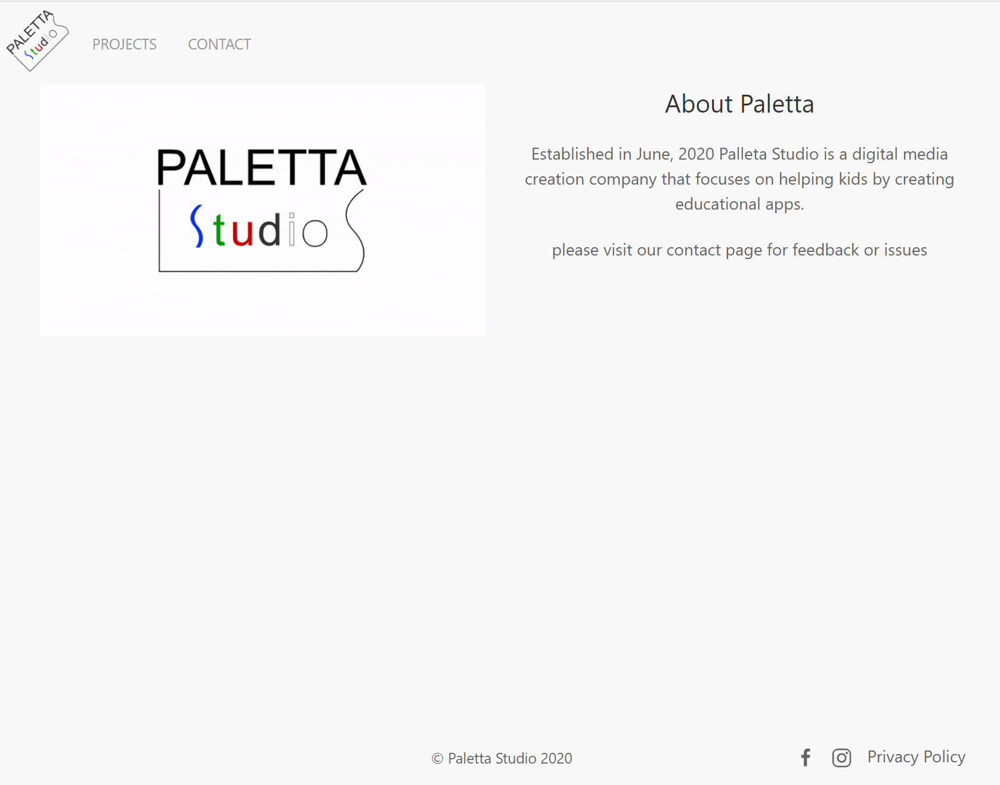
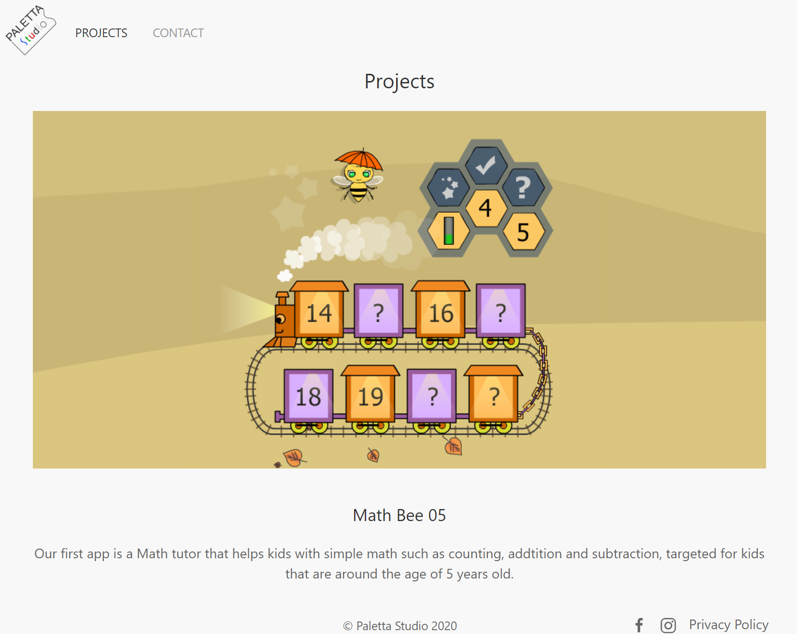
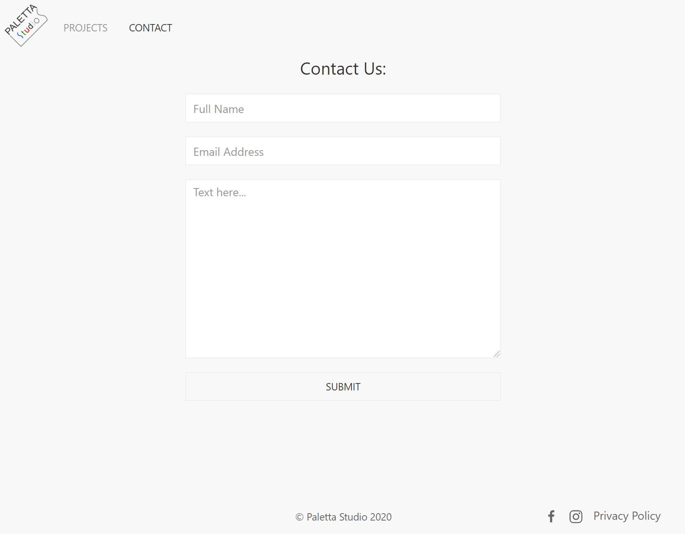

# paletta-studio

Pletta Studio is a digital media company that creates educational apps targeted to help kids.

This web site was created for infomational site about the company and is still not 100% complete.

Technologies:
* Html
* CSS 
* UIkit

Visit 

